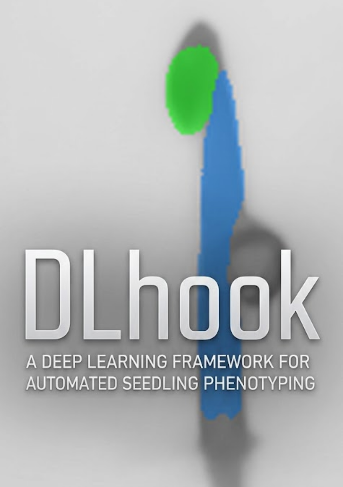
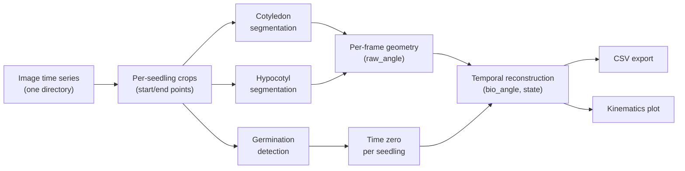
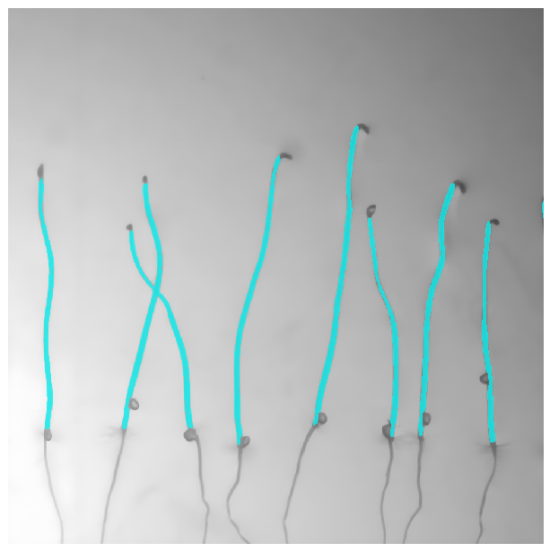
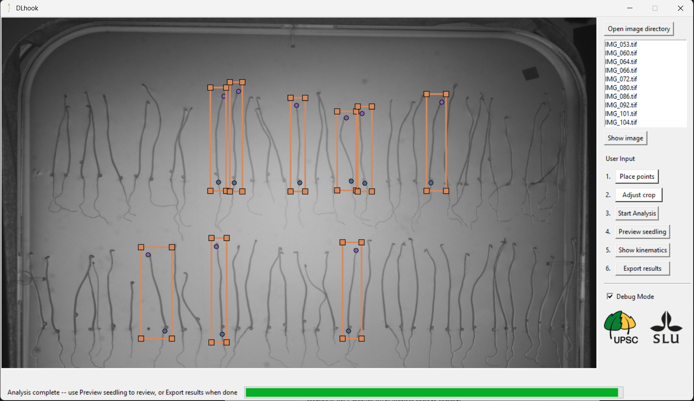
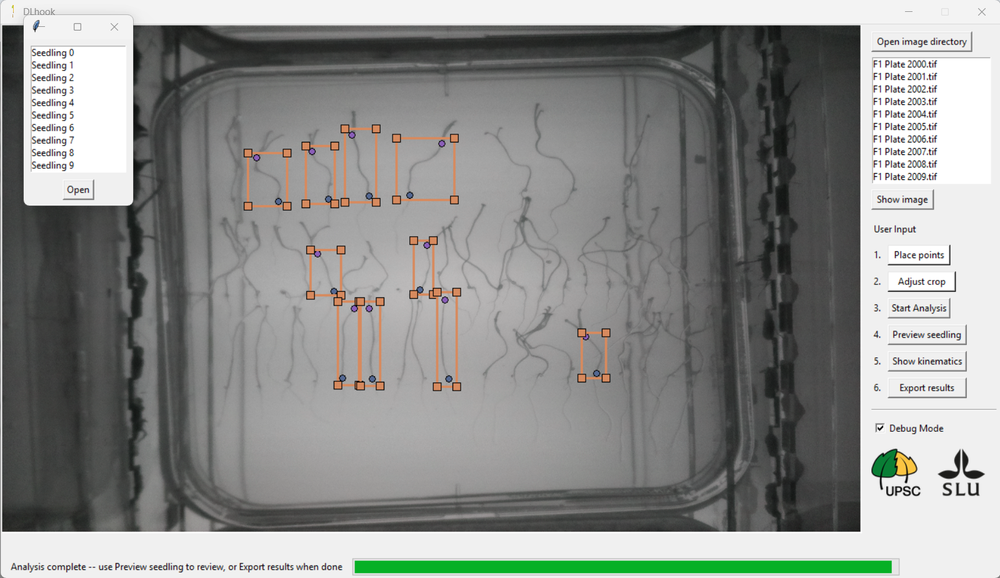
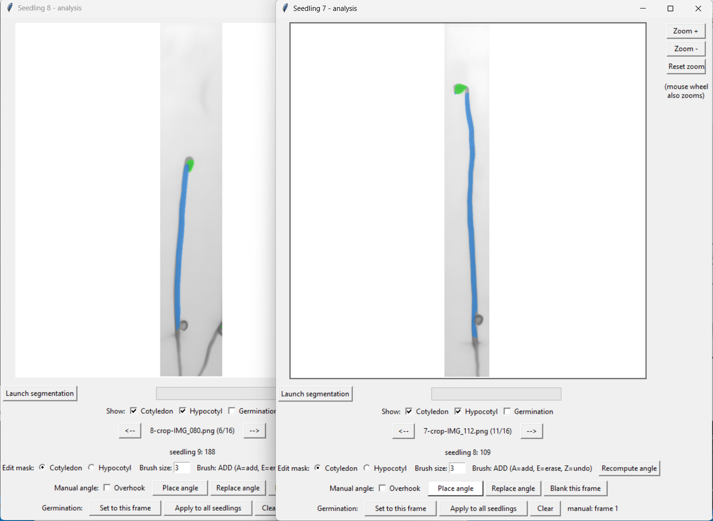
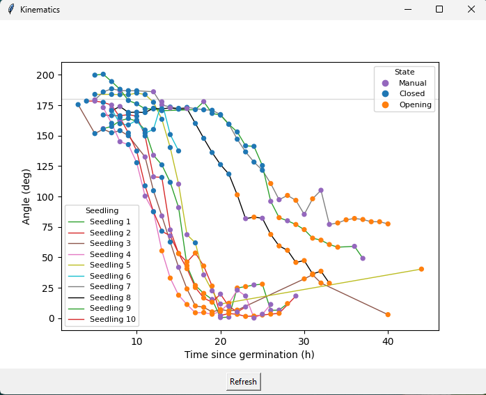

# DLhook

> _High-throughput apical hook phenotyping of dark-grown Arabidopsis thaliana seedlings_

`v0.3.0` · pre-release · GPL-3.0

**Lead Development:** David Radianu, Adrien Heymans

**Contributors:** Siamsa Doyle

**Coordination:** Stéphanie Robert, Sara Raggi




---

## What DLhook does

`DLhook` measures the apical hook angle of dark-grown *Arabidopsis thaliana* seedlings across an image time series, replacing the tedious work of measuring each hook by hand.

The pipeline has four stages:

1. **Segmentation.** A U-Net with group normalisation and residual connections (`UNetGNRes`, PyTorch) segments each cropped seedling into two classes — **cotyledon** and **hypocotyl**. A third model detects **germination**, which fixes time zero for each seedling independently.
2. **Geometry.** For every frame, an algorithm fits the cotyledon and stem, then computes the angle between them (`raw_angle`).
3. **Temporal reconstruction.** Per-frame readings are noisy and periodically ambiguous. A reconstruction pass resolves each frame against the whole series, producing a continuous biological angle (`bio_angle`) and a state (`Closed` / `Opening`).
4. **Review and export.** Every seedling can be inspected frame by frame, its masks corrected with a brush, and its angle overridden by hand before the results are written to a `.CSV`.

The network architecture and the trained weights derive from [RootPainter](https://github.com/Abe404/root_painter). Inference runs on [PyTorch](https://pytorch.org/).


```mermaid
flowchart LR
    A["Image time series\n(one directory)"] --> B["Per-seedling crops\n(start/end points)"]
    B --> C1["Cotyledon\nsegmentation"]
    B --> C2["Hypocotyl\nsegmentation"]
    B --> C3["Germination\ndetection"]
    C1 --> D["Per-frame geometry\n(raw_angle)"]
    C2 --> D
    C3 --> E["Time zero\nper seedling"]
    D --> F["Temporal reconstruction\n(bio_angle, state)"]
    E --> F
    F --> G["CSV export"]
    F --> H["Kinematics plot"]
```

---

## Installation

### 1. Clone the repository

```bash
git clone https://github.com/SRobertGroup/DLhook/
cd DLhook
```

### 2. Create the environment

> [!NOTE]
> We recommend [Mamba](https://mamba.readthedocs.io/en/latest/installation/mamba-installation.html) for creating the virtual environment ([Anaconda](https://www.anaconda.com/download) works too).
>
> For more on setting up conda, see the [conda user guide](https://conda.io/projects/conda/en/latest/user-guide/install).

The maintained path is the environment file, which pins Python 3.10 and a CUDA-enabled PyTorch:

```bash
mamba env create -f env.yaml
mamba activate dlhook_env
```

<details>
<summary>Alternative: build the environment by hand</summary>

```bash
mamba create -n dlhook_env python=3.10 -y
mamba activate dlhook_env
```

For **GPU** (CUDA), install a CUDA build of PyTorch first, then the rest:

```bash
pip3 install torch torchvision torchaudio --index-url https://download.pytorch.org/whl/cu124
pip3 install --no-cache-dir -r requirements.txt
```

For **CPU only**:

```bash
pip3 install torch torchvision torchaudio
pip3 install --no-cache-dir -r requirements.txt
```

</details>

Dependencies (see [`requirements.txt`](requirements.txt) and [`env.yaml`](env.yaml)): `torch`, `torchvision`, `torchaudio`, `realesrgan`, `opencv-python`, `scikit-image`, `pandas`, `matplotlib`, `pillow`.

> [!TIP]
> A GPU is optional but strongly recommended — segmentation is roughly **8× faster** on CUDA. Match the CUDA version to your driver; `env.yaml` requests CUDA 12.4, but newer builds work and are needed for recent GPU generations. Super-resolution of the crops only runs when CUDA is available.

### 3. Start DLhook

```bash
python main.py
```

> [!NOTE]
> You have to activate the environment (`mamba activate dlhook_env`) each time before launching the application.

### Model weights

Three models are loaded at runtime from [`weights/RootPainter_weights/`](weights/RootPainter_weights/):

| File | Class | Purpose |
|---|---|---|
| `cotyledon_v5.pkl` | cotyledon | cotyledon orientation |
| `hypocot_v5.pkl` | hypocotyl | hypocotyl direction |
| `germ_v1.pkl` | germination | per-seedling time zero |

A fourth model, Real-ESRGAN (`models/superres/RealESRGAN_x4plus.pth`), optionally super-resolves crops on CUDA.



---

## Input data

The input is a single directory holding one time series:

```
images_folder
   |-- Col0_001.tif
   |-- Col0_002.tif
   |-- ...
```

**Accepted extensions:** `.tif`, `.png`, `.jpg`, `.bmp`.

> [!IMPORTANT]
> The extension must be exactly four characters. `.tiff` and `.jpeg` will produce malformed output filenames — rename them to `.tif` / `.jpg` first.

**Frame ordering.** DLhook orders the series by the **capture time embedded in each file** (EXIF sub-IFD `DateTimeOriginal` / `DateTimeDigitized`, or TIFF tag 306), taking the earliest timestamp present. It falls back to the first integer found in the filename only when the embedded times are missing or unusable. Filesystem creation and modification times are deliberately **not** used — they are frequently identical across a whole series and therefore meaningless as an ordering key.

If the timestamps cannot be trusted — any frame missing one, or the series not strictly increasing — DLhook asks once for the **interval between images in minutes** (dialog: *No usable capture times*) and builds the time axis from that. ImageJ-exported TIFFs typically carry no timestamp at all and will always prompt.

---

## Workflow

Load a directory, place two points per seedling, and run the analysis. The sidebar is numbered 1–6 in the order you use it.



### Loading the series

Click **`Open image directory`** and select the folder containing one time series. The frames appear in the list, in acquisition order. Select any frame and click **`Show image`** to display it.

### 1. `Place points`

Work on the **last frame** of the series, where the seedlings are most developed. Each seedling needs **two clicks**:

- **Start point** (dark blue) — just above the seed coat.
- **End point** (purple) — at the apical hook.

As soon as a pair is complete, DLhook derives a crop box around it automatically. Repeat for every seedling you want to measure.

> Press **`z`** to undo the last click or the last completed pair.

### 2. `Adjust crop`

The crop boxes are already positioned from your point pairs; this step is only for correcting them. Toggle **`Adjust crop`** on, then drag any box's **four corner handles** to resize or reposition it. Each seedling has its own independently sized box at native image resolution — nothing is scaled or stretched.

> [!IMPORTANT]
> Toggle **`Adjust crop`** back **off** when you are finished. Steps 3–6 stay disabled until you do.

### 3. `Start Analysis`

Runs segmentation across every frame and every crop, then computes the per-frame angles. Progress is shown in the bar at the bottom of the window: cropping occupies the first 30%, segmentation and angle computation the remainder.

When it finishes, the status reads *"Analysis complete -- use Preview seedling to review, or Export results when done"*.



### 4. `Preview seedling`

Opens a picker; choose a seedling to open its **`Seedling N - analysis`** window. This is where all reviewing and correcting happens.

**Viewing**
- `Launch segmentation` — only needed if this seedling has not been segmented yet.
- `Show:` `Cotyledon` (green) · `Hypocotyl` (orange) · `Germination` (magenta, off by default).
- `<--` / `-->` step through frames.
- `Zoom +` / `Zoom -` / `Reset zoom`, or the mouse wheel.

**Correcting the masks**
- Pick `Edit mask:` `Cotyledon` or `Hypocotyl`, set `Brush size`, then paint on the image.
- **`a`** = add, **`e`** = erase, **`z`** = undo the last stroke. The current mode is shown as *Brush: ADD*.
- Click `Recompute angle` to re-measure the frame from the edited masks.

**Overriding the angle by hand**
- `Place angle` then three clicks defining the angle. Tick `Overhook` first if the cotyledon has folded back past closed.
- `Replace angle` to redo it, `Blank this frame` to discard the frame's measurement entirely — use this when the seedling has rotated so the cotyledon sits in front of or behind the hypocotyl, since a 2D image cannot yield a correct angle in that case.

**Germination**
- The detected frame is shown; `Set to this frame` overrides it, `Apply to all seedlings` propagates it, `Clear` removes it.




### 5. `Show kinematics`

Plots angle against time for all seedlings at once. Time is measured **since germination**, in hours when timestamps are available, otherwise in frames.

Two legends: **State** (marker colour — Closed, Opening, Manual, Unclassified) and **Seedling** (line colour). A **dashed** line means no germination frame was found for that seedling, so its time axis is not aligned to the others. The grey horizontal line marks 180° — a fully closed hook.

The plot does not auto-update; click `Refresh` after making corrections.




### 6. `Export results`

Choose a destination and DLhook writes the `.CSV`. Any seedling never opened in step 4 is segmented now, so exporting is safe even if you only reviewed a subset. Germination detection and temporal reconstruction run as part of the export.

---

## Output

The exported CSV is in **long format** — one row per seedling per frame:

| Column | Description |
|---|---|
| `img_name` | source image filename |
| `seedling_id` | seedling number, 1-based |
| `raw_angle` | the unmodified per-frame geometric reading, for auditing |
| `state` | `Closed`, `Opening`, or `Manual` (a hand-placed angle) |
| `bio_angle` | the reconstructed biological angle — **use this one** |

```csv
img_name,seedling_id,raw_angle,state,bio_angle
Col0_001.tif,1,178,Closed,179
Col0_001.tif,2,175,Closed,176
Col0_002.tif,1,172,Closed,174
```

Missing or unmeasurable values are written as empty strings.

### Angle convention

`bio_angle` is a continuous scale on which **180° means a fully closed hook**, decreasing toward 0° as the cotyledon opens. An **overhooked** seedling — folded back past closed — reads **above** 180°. Reconstructed values are constrained to the biologically admissible band **0°–250°**.

State is assigned with hysteresis to stop the label flickering at the transition: above **160°** the hook is treated as closed, below **150°** as opening, and the 150–160° band is a deadband. A seedling must stay below 150° for **5 consecutive frames** before the state commits to `Opening`.

---

## Advanced

**Debug Mode** (checkbox, on by default). When switched **off**, DLhook dumps `data/json_data/json_data.json` and a timestamped copy of your placed points to `data/debug_data/output/`. When **on**, it reads previously saved points back from `data/debug_data/input/`, which is useful for re-running the same plate without re-clicking.

**Dumping masks.** Masks are kept in memory. To also write them to `data/predict/` as PNGs:

```bash
DLHOOK_DUMP_MASKS=1 python main.py
```

**Tests.** 38 tests cover the angle reconstruction, capture-time parsing, germination detection and brush editing:

```bash
pytest
```

> [!CAUTION]
> The `torchvision.transforms.functional_tensor` shim at the top of `seedling_measurment.py` is load-bearing. It keeps `basicsr` / `realesrgan` importable on current torchvision versions — removing it breaks startup.

---

## Status & known limitations

DLhook v0.3.0 is a **pre-release**. It is usable and in active development, but the following are known and unresolved:

- **Germination timing is not validated.** Detection thresholds were tuned only on a few seedlings. The detected germination *frame* has never pass a good quality-check. Verify time zero manually for your own material.
- **Point placement in the main window is imprecise.** The main canvas stretches every image to a fixed 1100×650 regardless of aspect ratio, and the canvas-to-image mapping is a per-axis stretch rounded to whole pixels. Placement is accurate in the per-seedling window (step 4), which preserves aspect ratio; treat step 1 as coarse positioning.
- **Super-resolution adds a tiny fraction of detail** The 4× output is immediately resampled back to native size, so there is nothing extra to zoom into.
- **GPU and CPU results are not bit-identical** — roughly 1 pixel in 86,000 (0.001%) can differ.

---

## Licence

DLhook is released under the **GNU General Public License v3.0** — see [`LICENSE.txt`](LICENSE.txt).

The segmentation network architecture and the trained weights derive from [RootPainter](https://github.com/Abe404/root_painter) (Copyright © 2019, 2020 Abraham George Smith), which is GPLv3; DLhook is therefore GPLv3 as well.

---

## Citation

Please cite this repository while we work on the manuscript describing the method (see also [`CITATION.cff`](CITATION.cff)):

> David Radianu, Adrien Heymans, Siamsa Doyle, Stéphanie Robert\*, Sara Raggi\* (2025). DLhook: High-throughput apical hook phenotyping of dark-grown Arabidopsis thaliana seedlings. v0.3.0.
