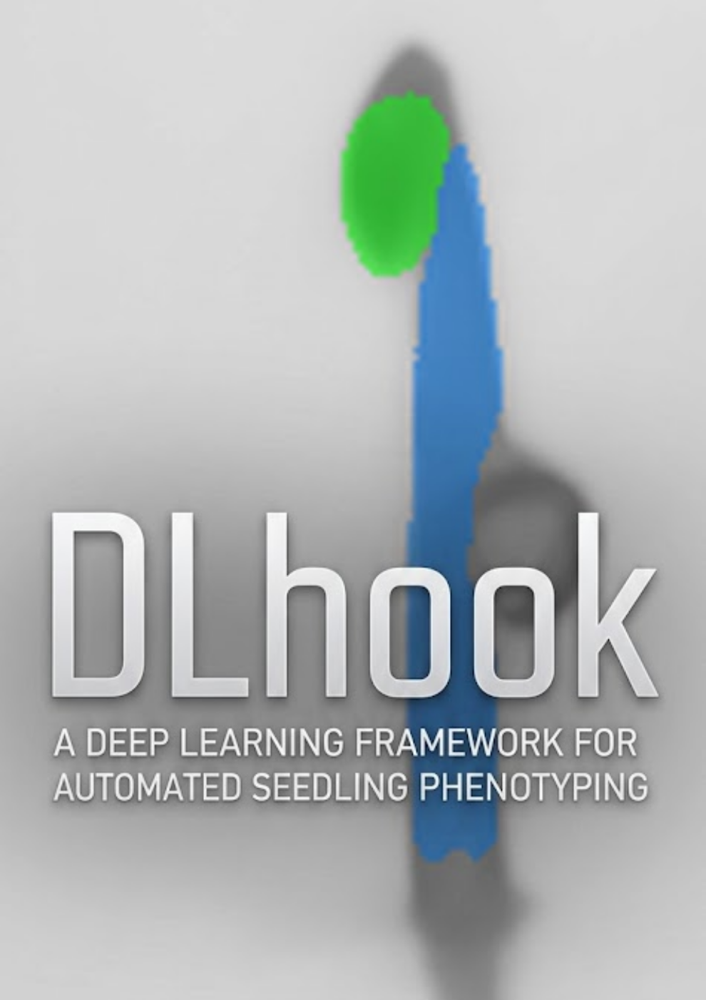
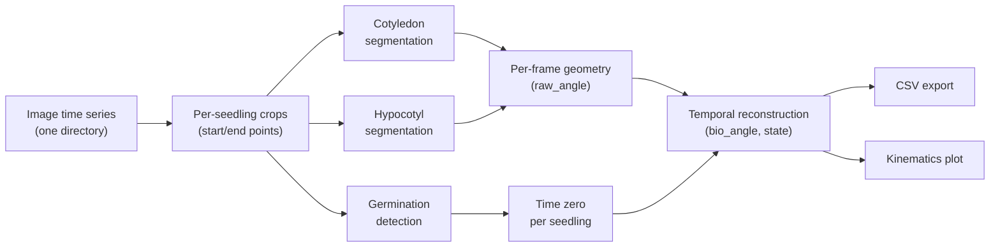
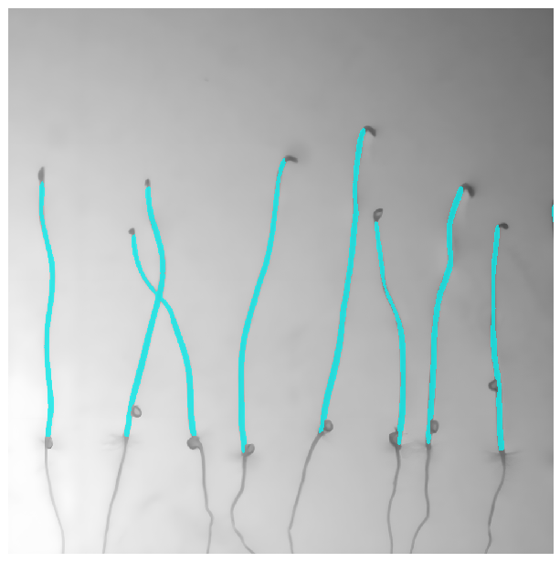
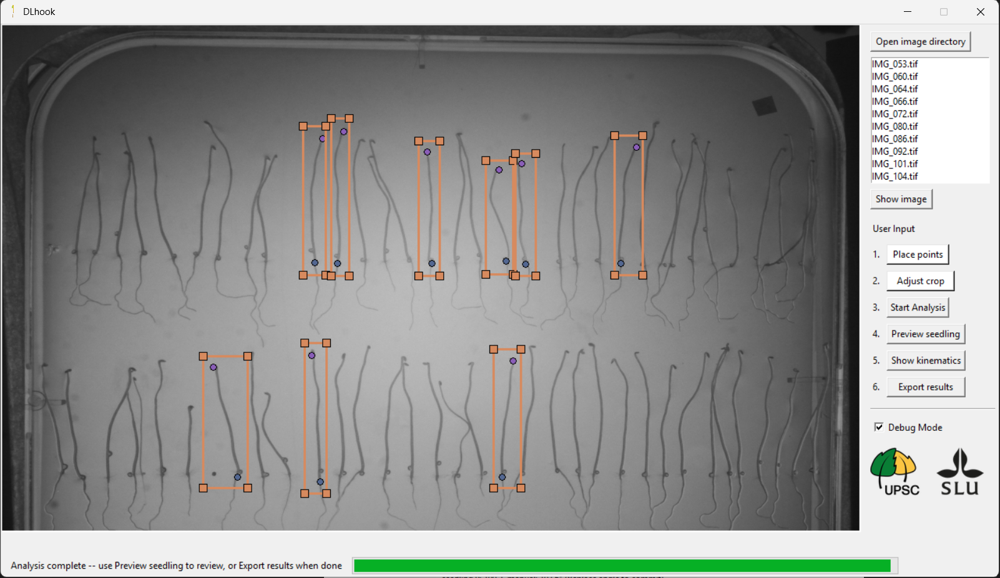
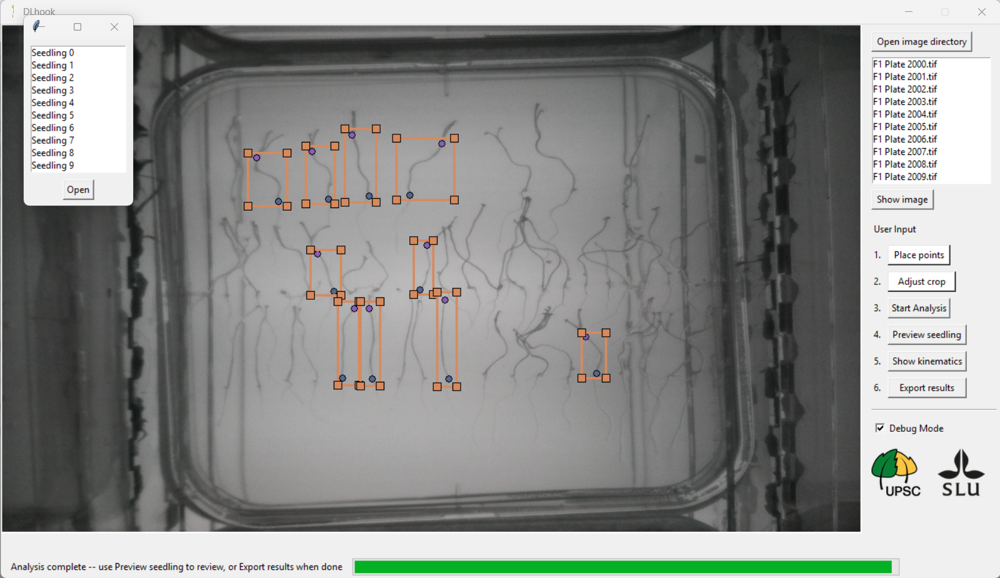
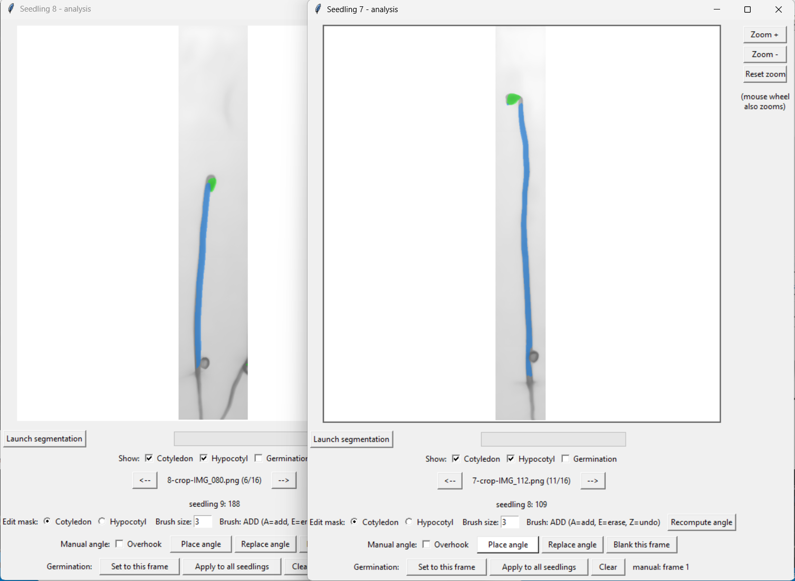
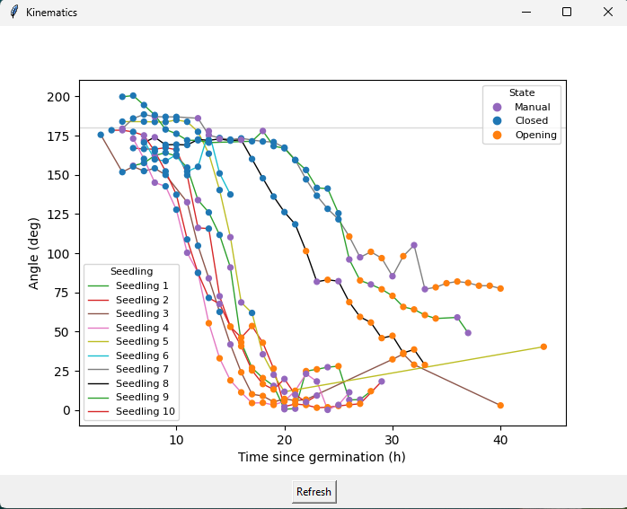

# DLhook

> _High-throughput apical hook phenotyping of dark-grown Arabidopsis thaliana seedlings_

`v0.3.0` · pre-release · GPL-3.0

**Lead Development:** David Radianu, Adrien Heymans

**Contributors:** Siamsa Doyle, Hemamshu Ratnakaram

**Coordination:** Stéphanie Robert, Sara Raggi




---

## What DLhook does

`DLhook` measures the apical hook angle of dark-grown *Arabidopsis thaliana* seedlings across an image time series, replacing the tedious work of measuring each hook by hand.

The pipeline has four stages:

1. **Segmentation.** A U-Net with group normalisation and residual connections (`UNetGNRes`, PyTorch) assigns every pixel of each cropped seedling to one of four classes — background, **cotyledon**, **hypocotyl**, or **radicle**. A separate model detects **germination** (the emerging radicle), which fixes time zero for each seedling independently. Earlier versions ran three separate two-class models instead of one four-class model; that path is retained and can still be selected — see [Which segmentation models run](#which-segmentation-models-run).
2. **Geometry.** For every frame, an algorithm fits the cotyledon and stem, then computes the angle between them (`raw_angle`).
3. **Temporal reconstruction.** Per-frame readings are noisy and periodically ambiguous. A reconstruction pass resolves each frame against the whole series, producing a continuous biological angle (`bio_angle`) and a state (`Closed` / `Opening`).
4. **Review and export.** Every seedling can be inspected frame by frame, its masks corrected with a brush, and its angle overridden by hand before the results are written to a `.CSV`.

The network architecture and the trained weights derive from [RootPainter](https://github.com/Abe404/root_painter). Inference runs on [PyTorch](https://pytorch.org/).


```mermaid
flowchart LR
    A["Image time series\n(one directory)"] --> B["Per-seedling crops\n(start/end points)"]
    B --> C1["Cotyledon\nsegmentation"]
    B --> C2["Hypocotyl\nsegmentation"]
    B --> C3["Germination\ndetection"]
    C1 --> D["Per-frame geometry\n(raw_angle)"]
    C2 --> D
    C3 --> E["Time zero\nper seedling"]
    D --> F["Temporal reconstruction\n(bio_angle, state)"]
    E --> F
    F --> G["CSV export"]
    F --> H["Kinematics plot"]
```

---

## Installation

### 1. Clone the repository

```bash
git clone https://github.com/SRobertGroup/DLhook/
cd DLhook
```

### 2. Create the environment

> [!NOTE]
> We recommend [Mamba](https://mamba.readthedocs.io/en/latest/installation/mamba-installation.html) for creating the virtual environment ([Anaconda](https://www.anaconda.com/download) works too).
>
> For more on setting up conda, see the [conda user guide](https://conda.io/projects/conda/en/latest/user-guide/install).

The maintained path is the environment file, which pins Python 3.10 and a CUDA-enabled PyTorch:

```bash
mamba env create -f env.yaml
mamba activate dlhook_env
```

<details>
<summary>Alternative: build the environment by hand</summary>

```bash
mamba create -n dlhook_env python=3.10 -y
mamba activate dlhook_env
```

For **GPU** (CUDA), install a CUDA build of PyTorch first, then the rest:

```bash
pip3 install torch torchvision torchaudio --index-url https://download.pytorch.org/whl/cu124
pip3 install --no-cache-dir -r requirements.txt
```

For **CPU only**:

```bash
pip3 install torch torchvision torchaudio
pip3 install --no-cache-dir -r requirements.txt
```

</details>

Dependencies (see [`requirements.txt`](requirements.txt) and [`env.yaml`](env.yaml)): `torch`, `torchvision`, `torchaudio`, `realesrgan`, `opencv-python`, `scikit-image`, `pandas`, `matplotlib`, `pillow`.

> [!TIP]
> A GPU is optional but strongly recommended — segmentation is roughly **8× faster** on CUDA. Match the CUDA version to your driver; `env.yaml` requests CUDA 12.4, but newer builds work and are needed for recent GPU generations. Super-resolution of the crops only runs when CUDA is available.

### 3. Start DLhook

```bash
python main.py
```

> [!NOTE]
> You have to activate the environment (`mamba activate dlhook_env`) each time before launching the application.

### Model weights

By default three two-class RootPainter models are loaded at runtime (the `binary` backend):

| File | Provides | Purpose |
|---|---|---|
| [`weights/RootPainter_weights/cotyledon_v5.pkl`](weights/RootPainter_weights/) | cotyledon | cotyledon orientation |
| [`weights/RootPainter_weights/hypocot_v5.pkl`](weights/RootPainter_weights/) | hypocotyl | hypocotyl direction |
| [`weights/RootPainter_weights/germ_v1.pkl`](weights/RootPainter_weights/) | germination | per-seedling time zero |

An experimental four-class model is available as an opt-in (see below). It uses these
weights instead, and they are not all included in a fresh clone:

| File | Provides | Purpose |
|---|---|---|
| `weights/multiclass/dlhook_4class_v1.pt` | cotyledon + hypocotyl | both classes from one four-class model |
| `weights/RootPainter_weights/germ_v2.pkl` | germination | per-seedling time zero |

Germination is kept on its own dedicated model rather than taken from the four-class
model, because the detected germination frame sets each seedling's time zero and a shift
there would move every downstream measurement for that seedling.

A further model, Real-ESRGAN (`models/superres/RealESRGAN_x4plus.pth`), optionally
super-resolves crops on CUDA. The 64 MB file is not in the repository: it is downloaded from the
official Real-ESRGAN release on first use and checked against a pinned SHA-256
(`models/superres/weights_info.py`); a file already at that path is used as is.

### Which segmentation models run

Set `DLHOOK_SEG_BACKEND` before launching to choose:

| Value | Behaviour |
|---|---|
| `binary` *(default)* | Three two-class models: `cotyledon_v5.pkl`, `hypocot_v5.pkl`, `germ_v1.pkl`. |
| `multiclass` *(experimental)* | Four-class model for cotyledon and hypocotyl, `germ_v2.pkl` for germination. |

```bash
DLHOOK_SEG_BACKEND=multiclass python main.py     # try the four-class model
```

`binary` stays the default until the four-class model has been validated: its precision
against human annotations is still well below the binary models' (see
[`docs/AUDIT.md`](docs/AUDIT.md), finding H-5). Use `multiclass` to compare the two
directly. The value is read once when the application starts, so it cannot be changed
part-way through a session — this is deliberate, so that one set of results can never mix
output from two different models. An unrecognised value stops the program with an error
rather than silently falling back.



---

## Input data

The input is a single directory holding one time series:

```
images_folder
   |-- Col0_001.tif
   |-- Col0_002.tif
   |-- ...
```

**Accepted extensions:** `.tif`, `.png`, `.jpg`, `.bmp`.

> [!IMPORTANT]
> The extension must be exactly four characters. `.tiff` and `.jpeg` will produce malformed output filenames — rename them to `.tif` / `.jpg` first.

**Frame ordering.** DLhook orders the series by the **capture time embedded in each file** (EXIF sub-IFD `DateTimeOriginal` / `DateTimeDigitized`, or TIFF tag 306), taking the earliest timestamp present. It falls back to the first integer found in the filename only when the embedded times are missing or unusable. Filesystem creation and modification times are deliberately **not** used — they are frequently identical across a whole series and therefore meaningless as an ordering key.

If the timestamps cannot be trusted — any frame missing one, or the series not strictly increasing — DLhook asks once for the **interval between images in minutes** (dialog: *No usable capture times*) and builds the time axis from that. ImageJ-exported TIFFs typically carry no timestamp at all and will always prompt.

---

## Workflow

Load a directory, place two points per seedling, and run the analysis. The sidebar is numbered 1–6 in the order you use it.



### Loading the series

Click **`Open image directory`** and select the folder containing one time series. The frames appear in the list, in acquisition order. Select any frame and click **`Show image`** to display it.

### 1. `Place points`

Work on the **last frame** of the series, where the seedlings are most developed. Each seedling needs **two clicks**:

- **Start point** (dark blue) — just above the seed coat.
- **End point** (purple) — at the apical hook.

As soon as a pair is complete, DLhook derives a crop box around it automatically. Repeat for every seedling you want to measure, in any order.

- **Boxes never overlap.** When a new box overlaps a neighbour, both are trimmed back to the midline of the gap between the two seedlings' clicked points. A box is never trimmed inside its own points. If two seedlings' points actually cross, the boxes cannot be separated: they are outlined in **red** and the status bar names them.
- **Each box shows its seedling ID** in its top-left corner. IDs are numbered across the plate **top-to-bottom, then left-to-right**, and renumbered as you add or remove seedlings. This number is the `seedling_id` in the exported CSV and the number in *Preview seedling*.

> Press **`z`** to undo the last click or the most recently placed pair. This works even if that seedling has since been renumbered.

### 2. `Adjust crop`

The crop boxes are already positioned from your point pairs; this step is only for correcting them. Toggle **`Adjust crop`** on, then drag any box's **four corner handles** to resize or reposition it. A resize stops at a neighbouring box and at the image border, and IDs stay fixed while you adjust. Each seedling has its own independently sized box at native image resolution — nothing is scaled or stretched.

> [!IMPORTANT]
> Toggle **`Adjust crop`** back **off** when you are finished. Steps 3–6 stay disabled until you do.

### 3. `Start Analysis`

Runs segmentation across every frame and every crop, then computes the per-frame angles. Progress is shown in the bar at the bottom of the window: cropping occupies the first 30%, segmentation and angle computation the remainder.

When it finishes, the status reads *"Analysis complete -- use Preview seedling to review, or Export results when done"*.



### 4. `Preview seedling`

Opens a picker; choose a seedling to open its **`Seedling N - analysis`** window. This is where all reviewing and correcting happens.

**Viewing**
- `Launch segmentation` — only needed if this seedling has not been segmented yet.
- `Show:` `Cotyledon` (green) · `Hypocotyl` (orange) · `Germination` (magenta, off by default).
- `<--` / `-->` step through frames.
- `Zoom +` / `Zoom -` / `Reset zoom`, or the mouse wheel.

**Correcting the masks**
- Pick `Edit mask:` `Cotyledon` or `Hypocotyl`, set `Brush size`, then paint on the image.
- **`a`** = add, **`e`** = erase, **`z`** = undo the last stroke. The current mode is shown as *Brush: ADD*.
- Click `Recompute angle` to re-measure the frame from the edited masks.

**Overriding the angle by hand**
- `Place angle` then three clicks defining the angle. Tick `Overhook` first if the cotyledon has folded back past closed.
- `Replace angle` to redo it, `Blank this frame` to discard the frame's measurement entirely — use this when the seedling has rotated so the cotyledon sits in front of or behind the hypocotyl, since a 2D image cannot yield a correct angle in that case.

**Germination**
- The detected frame is shown; `Set to this frame` overrides it, `Apply to all seedlings` propagates it, `Clear` removes it.




### 5. `Show kinematics`

Plots angle against time for all seedlings at once. Time is measured **since germination**, in hours when timestamps are available, otherwise in frames.

Two legends: **State** (marker colour — Closed, Opening, Manual, Unclassified) and **Seedling** (line colour). A **dashed** line means no germination frame was found for that seedling, so its time axis is not aligned to the others. The grey horizontal line marks 180° — a fully closed hook.

The plot does not auto-update; click `Refresh` after making corrections.




### 6. `Export results`

Choose a destination and DLhook writes the `.CSV`. Any seedling never opened in step 4 is segmented now, so exporting is safe even if you only reviewed a subset. Germination detection and temporal reconstruction run as part of the export.

---

## Output

The exported CSV is in **long format** — one row per seedling per frame:

| Column | Description |
|---|---|
| `img_name` | source image filename |
| `seedling_id` | seedling number, 1-based |
| `raw_angle` | the unmodified per-frame geometric reading, for auditing |
| `state` | `Closed`, `Opening`, or `Manual` (a hand-placed angle) |
| `bio_angle` | the reconstructed biological angle — **use this one** |
| `time_elapsed_min` | time (min) |
| `germination_frame` | frame which display germination of seedling | 

```csv
img_name,seedling_id,raw_angle,state,bio_angle,time_elapsed_min,germination_frame 
Col0_001.tif,1,178,Closed,179,0,,
Col0_001.tif,2,175,Closed,176,60,,
Col0_002.tif,1,172,Closed,174,120,,
```

Missing or unmeasurable values are written as empty strings.

### Angle convention

`bio_angle` is a continuous scale on which **180° means a fully closed hook**, decreasing toward 0° as the cotyledon opens. An **overhooked** seedling — folded back past closed — reads **above** 180°. Reconstructed values are constrained to the biologically admissible band **0°–220°** (up to 40° of overhook past closed).

State is assigned with hysteresis to stop the label flickering at the transition: above **160°** the hook is treated as closed, below **150°** as opening, and the 150–160° band is a deadband. A seedling must stay below 150° for **5 consecutive frames** before the state commits to `Opening`.

---

## Ground-truth angle annotation

To check the automatic angles against your own measurements, measure a random sample of frames by hand with the annotation tool. It shows each seedling crop zoomed in and records the angle you measure.

```bash
python -m ui.angle_annotator --folder path/to/crops     # crops named {id}-crop-{frame}.png
python -m ui.angle_annotator --folder path/to/crops --per-seedling 15 --seed 1
```

DLhook writes the crops to `data/images/` during *Start Analysis*, but wipes `data/` at startup and exit, so copy them to a folder of your own first if you want to annotate across sessions.

You can also annotate the crops used to train the four-class model (`cropped_training_set/`, made by `multi/recrop_plates.py`). Its `manifest.csv` is picked up automatically, which keeps each series' seedlings apart (`crop_id` repeats across series) and records the source frame as `img_name`. Add `--split val` to keep only images the four-class model never trained on, which is the unbiased set to validate it with:

```bash
python -m ui.angle_annotator --folder cropped_training_set --split val
```

For each frame, click five points (the mouse wheel zooms at the cursor, and the zoom is kept between frames of the same seedling):

1. the **junction** where the cotyledons meet the hypocotyl,
2. two points on the **hypocotyl** axis,
3. two points on the **cotyledon** axis.

Each axis is oriented automatically away from the junction, so the order of the two points on an axis does not matter. Tick **Overhook** if the hook has folded back past closed. Press `Enter` to save and move on, `Backspace` to undo a point and `S` (or `Right` / *Next*) to skip a frame you cannot measure. Moving on from a frame you did not measure records it as **skipped**, so the CSV tells "looked at and rejected" apart from "not reached yet"; `Left` goes back without recording anything. If a CSV predates this behaviour, `python -m ui.angle_annotator --folder cropped_training_set --split val --mark-unrecorded-skipped` records every frame of the same sample that has no row as skipped (use the same `--folder`, `--split`, `--per-seedling` and `--seed` as the session) and exits without opening the window.

To compare your measurements with the pipeline, run `python -m multi.validate_angles`. It runs the real pipeline with both backends on every crop of the seedlings you measured and prints the error per backend and per series (written to `multi/results/angle_validation/`).

Frames are a reproducible random sample (`--per-seedling`, `--seed`), grouped by seedling and shuffled within it so you cannot be guided by time order. Results go to `angle_ground_truth.csv` in the repository root (change with `--out`). The file is saved after every frame, and the tool resumes where you stopped. `bio_angle` uses the same convention as the exported CSV (180 = closed, decreasing as the hook opens, above 180 = overhooked), and `seedling_id` and `frame` match the crop file names (plus `series` and `img_name` for the training crops), so the two can be joined directly.

## Training a landmark head from your annotations

The same clicks can retrain the four-class model to find the cotyledon/hypocotyl **junction** and the two axis directions directly, instead of fitting ellipses. That removes the direction ambiguity of an ellipse. The landmark angle is always `180 - theta`: there is no overhook reading, because overhooked frames sit only a few degrees past 180° (median 6.5°), below the repeatability of the clicks themselves (your own repeat measurements differ by about 4° at the median, and the overhook call by 8%).

**1. Annotate training frames** (never reuse your test set):

```bash
python -m ui.angle_annotator --folder cropped_training_set --split train --out angle_landmarks_train.csv --per-seedling 10 --seed 1
```

Aim for at least 400 measured frames spread over the series. Click the same way every time, because the model learns exactly what you click:

- **junction**: the joint where the cotyledons meet the hypocotyl;
- **hypocotyl** points: on the midline of the stem just below the junction;
- **cotyledon** points: on the midline of the cotyledon, starting at the junction;
- the **Overhook** tick is still recorded in the CSV but ignored by landmark training and by `multi/validate_angles.py` (which scores against `180 - theta`; `--keep-overhook` restores the raw angle).

`--split train` keeps your frames out of the validation split, and the training code drops any validation-split crop it finds in the CSV anyway, so `angle_ground_truth.csv` stays a clean test set.

**2. Fine-tune** from the shipped four-class checkpoint (adds a landmark head, keeps the segmentation):

```bash
python multi/train_unet_multiclass.py --config multi/configs/training_landmarks.yaml
```

The first epochs train only the new head, then the whole network. The best epoch is chosen by the angle error on held-out annotated seedlings, among epochs whose segmentation score stays above `landmarks.min_mean_fg_dice`. Checkpoints go to `multi/results/models_landmarks/`.

**3. Score it on your held-out ground truth**, next to the current pipeline:

```bash
python -m multi.validate_angles --backends multiclass --landmark-checkpoint multi/results/models_landmarks/best.pt
```

The landmark readings appear as `landmark` (per frame) and `landmark_recon` (after reconstruction). The GUI still uses the ellipse pipeline; switching it to landmarks is a separate step to take only if these numbers are better.

## Advanced

**Debug Mode** (checkbox, on by default). When switched **off**, DLhook dumps `data/json_data/json_data.json` and a timestamped copy of your placed points to `data/debug_data/output/`. When **on**, it reads previously saved points back from `data/debug_data/input/`, which is useful for re-running the same plate without re-clicking.

**Dumping masks.** Masks are kept in memory. To also write them to `data/predict/` as PNGs:

```bash
DLHOOK_DUMP_MASKS=1 python main.py
```

**Tests.** About 250 tests cover the angle reconstruction, capture-time parsing, germination detection, brush editing, crop-box layout, segmentation backends and the `multi/` training pipeline. No GPU or image data is needed:

```bash
pytest
```

> [!CAUTION]
> The `torchvision.transforms.functional_tensor` shim at the top of `seedling_measurment.py` is load-bearing. It keeps `basicsr` / `realesrgan` importable on current torchvision versions — removing it breaks startup.

---

## Status & known limitations

DLhook v0.3.0 is a **pre-release**. It is usable and in active development, but the following are known and unresolved:

- **Germination timing is not validated.** Detection thresholds were tuned only on a few seedlings. The detected germination *frame* has never pass a good quality-check. Verify time zero manually for your own material.
- **Point placement in the main window is imprecise.** The main canvas stretches every image to a fixed 1100×650 regardless of aspect ratio, and the canvas-to-image mapping is a per-axis stretch rounded to whole pixels. Placement is accurate in the per-seedling window (step 4), which preserves aspect ratio; treat step 1 as coarse positioning.
- **Super-resolution adds a tiny fraction of detail** The 4× output is immediately resampled back to native size, so there is nothing extra to zoom into.
- **GPU and CPU results are not bit-identical** — roughly 1 pixel in 86,000 (0.001%) can differ.

---

## Licence

DLhook is released under the **GNU General Public License v3.0** — see [`LICENSE.txt`](LICENSE.txt).

The segmentation network architecture and the trained weights derive from [RootPainter](https://github.com/Abe404/root_painter) (Copyright © 2019, 2020 Abraham George Smith), which is GPLv3; DLhook is therefore GPLv3 as well.

---

## Citation

Please cite this repository while we work on the manuscript describing the method (see also [`CITATION.cff`](CITATION.cff)):

> David Radianu, Adrien Heymans, Siamsa Doyle, Hemamshu Ratnakaram, Stéphanie Robert\*, Sara Raggi\* (2025). DLhook: High-throughput apical hook phenotyping of dark-grown Arabidopsis thaliana seedlings. v0.3.0.
