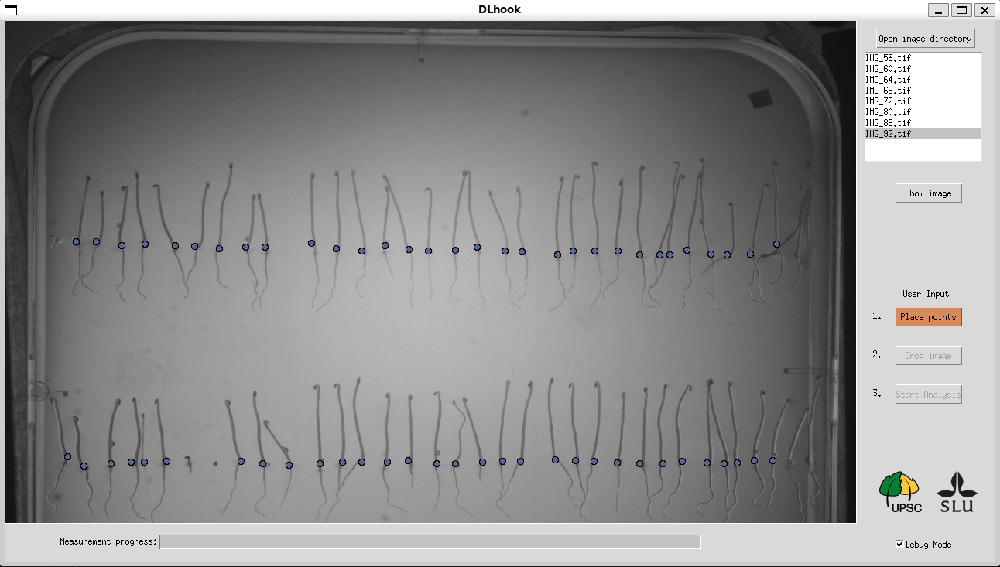
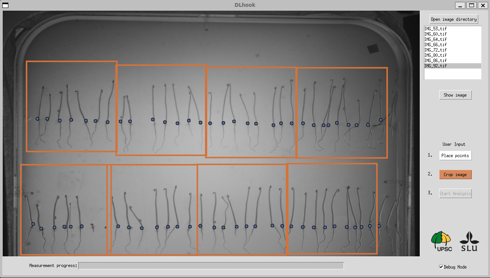

# DLhook - Seedling Apical Hook Phenotyping

The provided software is developed to measure the apical hook angle of dark grown Arabidopsis thaliana seedlings, with the intention of speeding up the tedious labor of maually measuring the apical hooks.
The software utilizes the deep learning - convolutional neural network architecture called U-Net which was developed to segment objects in biological images. The segmentations are thereon further manipulated to yeild the apical hook angle of each seedling in the input images. 

The provided deep learning model(tensorflow) comes with pre-trained weights trained on dark-grown Arabidopsis thaliana seedlings, to classify the seedlings into two separate classes; the cotyledon and the hypocotyl.
An algorithm then uses the model outputs to extract the angles between the cotyledons and hypocotyls.

Once the analysis is completed and checked, the output data is saved in a CSV/excel file. 


## Installation, dependencies <a name="usage"></a>
To facilitate a smooth installation of the application we recommend that you install Anaconda Navigator from: https://www.anaconda.com/products/individual.


<b>Step 1</b>
When starting Anaconda Navigator we recommend that you create a new enviroment, and installing the required packages in the isolated environment. 


<b>Step 2</b>
Upon that you can click on the newly created enviroment and click on Open Terminal

The software requires the following python libraries. 
The bundle of libraries can be installed by running: pip install -r requirements.txt in your shell.

- opencv_python==4.5.1.48
- scikit_image==0.17.2
- numpy==1.19.5
- tensorflow_gpu==2.4.1
- matplotlib==3.3.4
- pandas==1.1.5
- typing_extensions==3.7.4.3
- Pillow==8.3.2
- tensorflow==2.6.0

<b>Step 3</b>
Then you go to the directory where you have the seedling-software files in the following way on a Windows PC

As my seedling application folder is located at "C:\Users\David\Desktop\seedling_software" I type "cd C:\Users\David\Desktop\seedling_software" and press enter to get to the location.

Thereon I type: 'pip install -r requirements.txt' in the terminal and press enter, this will install the packages in your envrioment. 


Once the packages are installed you then type "python GUI.py" in the terminal and press enter. This will open the application. You will have to enter the Anaconda enviroment each time you want to open the application (seen in Step 2 above). This will start the apical hook application.


## Application usage tutorial <a name="tutorial"></a>

The input should be a directory containing the batch of the kinematics images with ascending number-ID on in the image names, as seen in the example bellow. 


```bash
images_folder
   |-- images
       |-- img001.png
       |-- img002.png
       |-- ...
```


The optimal image dimension is X * X. In case that the images are not in this size, we have included a helper script which transforms the image to the optimal image size(by keeping the original image ratio). The script scales up/down the images over a white background of size X * X.


 Start the software by starting the file GUI.py


<b>Step 1</b>. Start by sorting the images in the correct order for the kinematics to be analyzed correctly. 
By selecting a image name in the list of files and then clicking on the "Sort image" button the selected name gets imported to the text box bellow. 


<b>Step 2</b>. Select the filename from the start up until the numbering which determines the image ID, and then click on the button "start-string->". If the image-name starts with the ID-number you can click on the the "start-string->" button without selecting anything in the filename.


<b>Step 3</b>. Select the filename from the numbering to the end of the filename, and then click on the button "<-end-string". The images will now be sorted in the correct order.


<b>Step 4</b>. Click on the last filename in the sorted list and click on the "Show image" button. Theron place the 'starting points' of the seedlings by clicking on the "Place points" button and place the points above the seed coats(the seed coats are the shells  as seen in the image bellow (sometimes the seed coats are located at a higher level then the rest of the seed coats, if so place the point in the same Y-level as the rest of the points as seen bellow).





<b>Step 5</b>. Crop the regions of interest containing the seedlings by clicking on the button "Crop image" and placing squares around the seedlings. Click on the 'Crop images' button again when finished.  




<b>Step 6</b>. To start the analysis click the button "Start Analysis". The progress of the analysis can be seen in the progress bar bellow the input image.


<b>Step 5</b>. The following image shows the apical hook measurments given by the software. The user has to go through and double-check if the measurments are correct or not before saving the data to a CSV-file(excel).


<b>Step 6</b>. If a yeilded measurment is incorrect the user can correct it directly in the software by firstly clicking on the incorrect measurment in the list (in the example bellow seedling ID-2 is selected), and then pressing the "Place angle" button. Thereon place three points which forms and angle reprecenting the apical hook of the specific seedling. The image bellow illustrates a manually placed angle on seedling with ID-2. The "Manual angle:" section in the graphical user interface shows the angle of the manually placed angle. If the manually placed angle is incorrectly placed, the user can just click on any location on the image once again, thus removing the previously placed angle and starting a new one. If the user wants to manually replace a seedling with a overhook the "Overhook" checkbox should be checked, and when placing the manually placed angle should be pointing downwards.


<b>Step 7</b>. The user does also have the posibility to fill in the apical hook angles of seedlings which are rotating, such that the cotyledon is in the front/back of the hypocotyl(parallel to). As the apical hook angle of rotating seedlings can't be measured correctly by a 2D image. Thus, the user can select the seedling from the start of the rotation and the end of the rotation when the cotyledon is pointing in the opposite direction, the software will then fill in the angle from the 'start seedling' to all the timesteps between to the 'end seedling'.
The following image illustrates how the software automatically measures the apical hook angle of a rotating apical hook compared to the manually corrected apical hook angle.

