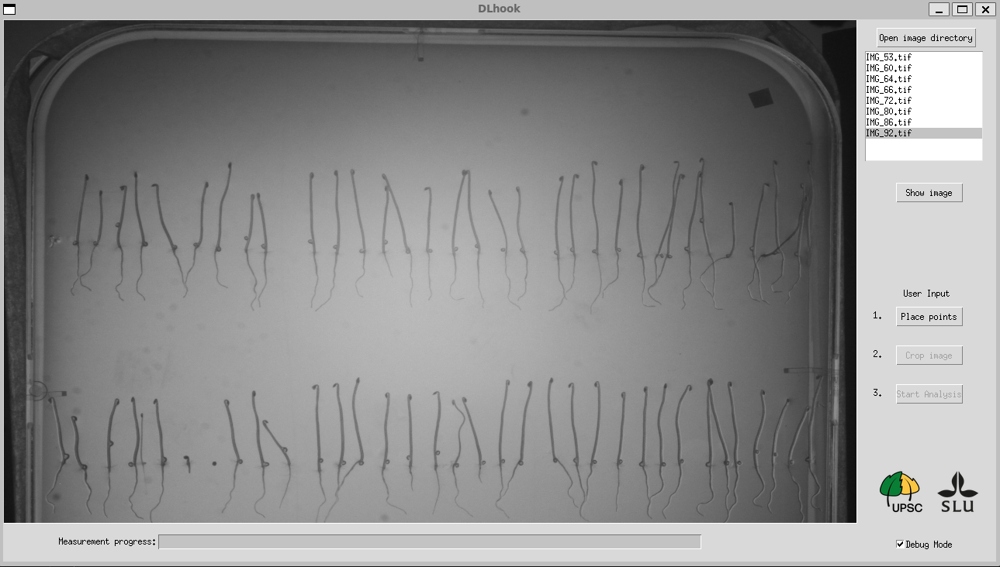

# DLhook
> _High-throughput apical hook phenotyping of dark-grown Arabidopsis thaliana seedlings_

**Lead Development:** David Radianu, Adrien Heymans

**Contributors:** Siamsa Doyle

**Coordination:** Stéphanie Robert, Sara Raggi

--- 

The `DLhook` software is developed to measure the apical hook angle of dark grown *Arabidopsis thaliana* seedlings, with the intention of speeding up the tedious labor of maually measuring the apical hooks.
The software utilizes the deep learning convolutional neural network (CNN) architecture called `U-Net` which segment objects in biological images. The segmentations are thereon further manipulated to yeild the apical hook angle of each seedling in the input images of the time-series. 

The provided deep learning model comes with pre-trained weights trained on dark-grown Arabidopsis thaliana seedlings, to classify the seedlings into two separate classes; the cotyledon and the hypocotyl. The used library is: [tensorflow](https://www.tensorflow.org/).
An algorithm then uses the model outputs to extract the angles between the cotyledons and hypocotyls.

Once the analysis is completed and checked, the output data is saved in a `.CSV` file.

## Installation

### Clone the Repository

```bash
git clone https://github.com/SRobertGroup/DLhook/
cd DLhook
```
### Create the virtual environment

>[!NOTE] 
> We recommend to use [Mamba](https://mamba.readthedocs.io/en/latest/installation/mamba-installation.html) to create a virtual environment to run the software in it ([Anaconda](https://www.anaconda.com/download) works also)
>
> For more information on how to set-up conda, please check the [conda user guide](https://conda.io/projects/conda/en/latest/user-guide/install)

```bash
mamba create -n dlhook_env python=3.10 -y
mamba activate dlhook_env
```

### Install dependencies:

- pytorch
- tensorflow
- realesrgan
- opencv
- pillow

```bash
pip3 install torch torchvision torchaudio --index-url https://download.pytorch.org/whl/cu118
pip3 install --no-cache-dir -r requirements.txt
```
### Start DLhook

```bash
python main.py
```
This will open the application.

> **NOTE** You will have to enter the virtual enviroment each time you want to open the application

# Application usage tutorial <a name="tutorial"></a>

The input should be a directory containing the batch of the kinematics images with ascending number-ID on in the image names, as seen in the example bellow. 

```bash
images_folder
   |-- images
       |-- img001.png
       |-- img002.png
       |-- ...
```


<b>Step 1</b>. Load the directory with one time-series that you want to analyse. 



<b>Step 2</b>. Place the 'starting points' of the seedlings on the last image of the time-series by clicking on the `Place points` button and place the points above the seed coats (the seed coats are the shells  as seen in the image bellow (sometimes the seed coats are located at a higher level then the rest of the seed coats, if so place the point in the same Y-level as the rest of the points as seen bellow).


<b>Step 3</b>. Crop the regions of interest containing the seedlings by clicking on the button `Crop image` and placing squares around the seedlings. Click on the `Crop images` button again when finished.  


<b>Step 4</b>. To start the analysis click the button `Start Analysis`. The progress of the analysis can be seen in the progress bar bellow the input image.


<b>Step 5</b>. The following image shows the apical hook measurments given by the software. The user has to go through and double-check if the measurments are correct or not before saving the data to a `CSV`.


<b>Step 6</b>. If a yeilded measurment is incorrect the user can correct it directly in the software by firstly clicking on the incorrect measurment in the list, and then pressing the `Place angle` button. Thereon place three points which forms and angle reprecenting the apical hook of the specific seedling. The `Manual angle:` section in the graphical user interface shows the angle of the manually placed angle. If the manually placed angle is incorrectly placed, the user can just click on any location on the image once again, thus removing the previously placed angle and starting a new one. If the user wants to manually replace a seedling with a overhook the `Overhook` checkbox should be checked, and when placing the manually placed angle should be pointing **downwards**.


<b>Step 7</b>. The user does also have the posibility to fill in the apical hook angles of seedlings which are rotating, such that the cotyledon is in the front/back of the hypocotyl(parallel to). As the apical hook angle of rotating seedlings can't be measured correctly by a 2D image. Thus, the user can select the seedling from the start of the rotation and the end of the rotation when the cotyledon is pointing in the opposite direction, the software will then fill in the angle from the 'start seedling' to all the timesteps between to the 'end seedling'.
The following image illustrates how the software automatically measures the apical hook angle of a rotating apical hook compared to the manually corrected apical hook angle.


## Citation

Cite this repository while we are working on the manuscript describing the methods:
> David Radianu, Adrien Heymans, Siamsa Doyle, Stéphanie Robert*, Sara Raggi* (2025). DLhook: High-throughput apical hook phenotyping of dark-grown Arabidopsis thaliana seedlings.


